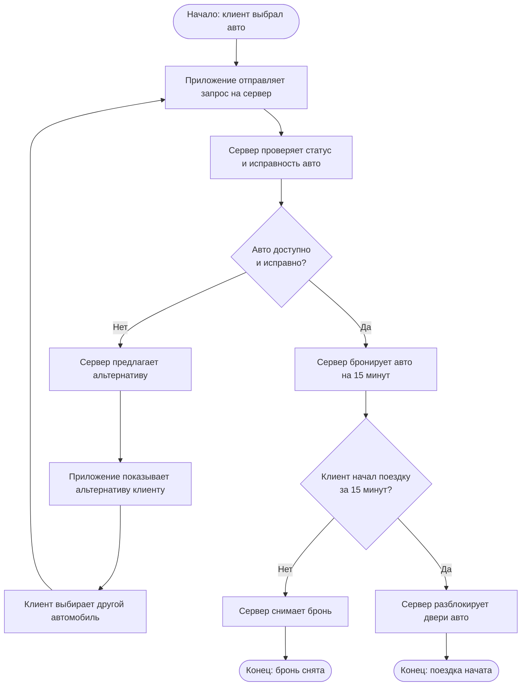

```mermaid
flowchart TD
    Start([Начало: клиент выбрал авто]) --> Request[Приложение отправляет запрос на сервер]
    Request --> Check[Сервер проверяет статус и исправность авто]
    Check --> Available{Авто доступно<br>и исправно?}

    Available -->|Нет| Offer[Сервер предлагает альтернативу]
    Offer --> Show[Приложение показывает альтернативу клиенту]
    Show --> Choose[Клиент выбирает другой автомобиль]
    Choose --> Request

    Available -->|Да| Book[Сервер бронирует авто на 15 минут]
    Book --> Started{Клиент начал поездку<br>за 15 минут?}

    Started -->|Нет| Cancel[Сервер снимает бронь]
    Cancel --> EndCancel([Конец: бронь снята])

    Started -->|Да| Unlock[Сервер разблокирует двери авто]
    Unlock --> EndSuccess([Конец: поездка начата])
```