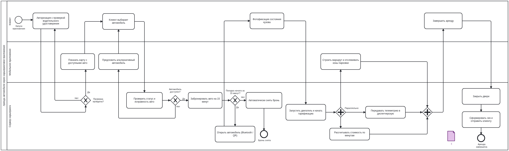
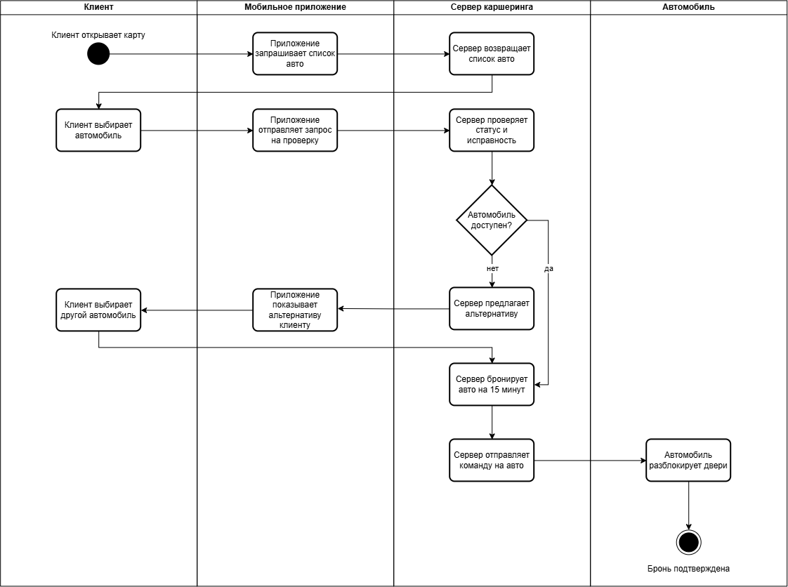
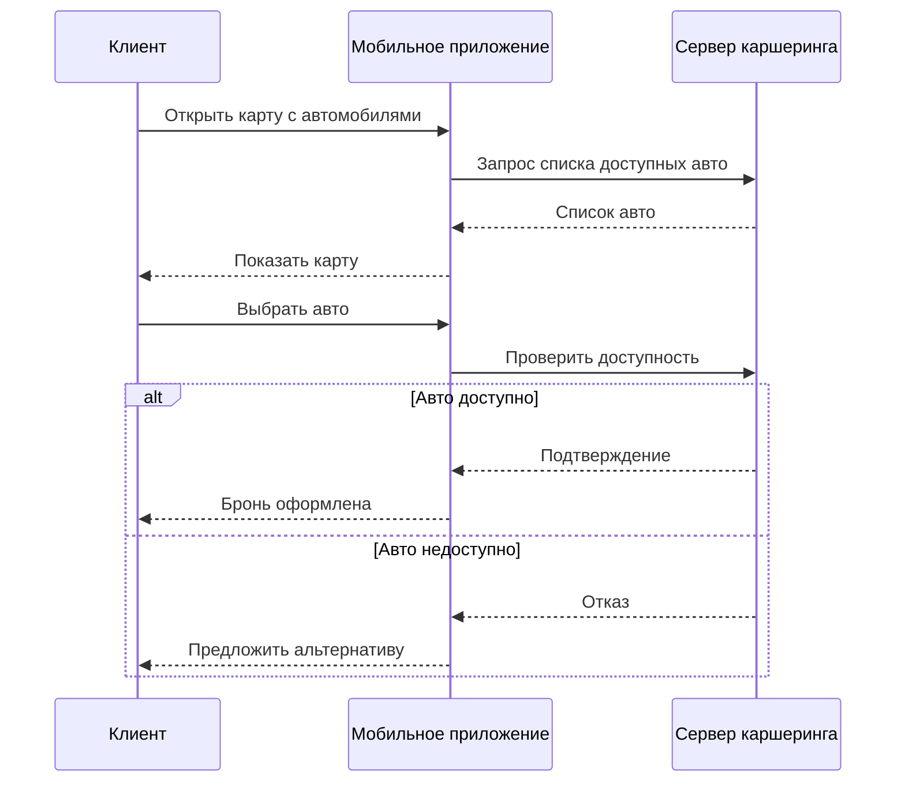
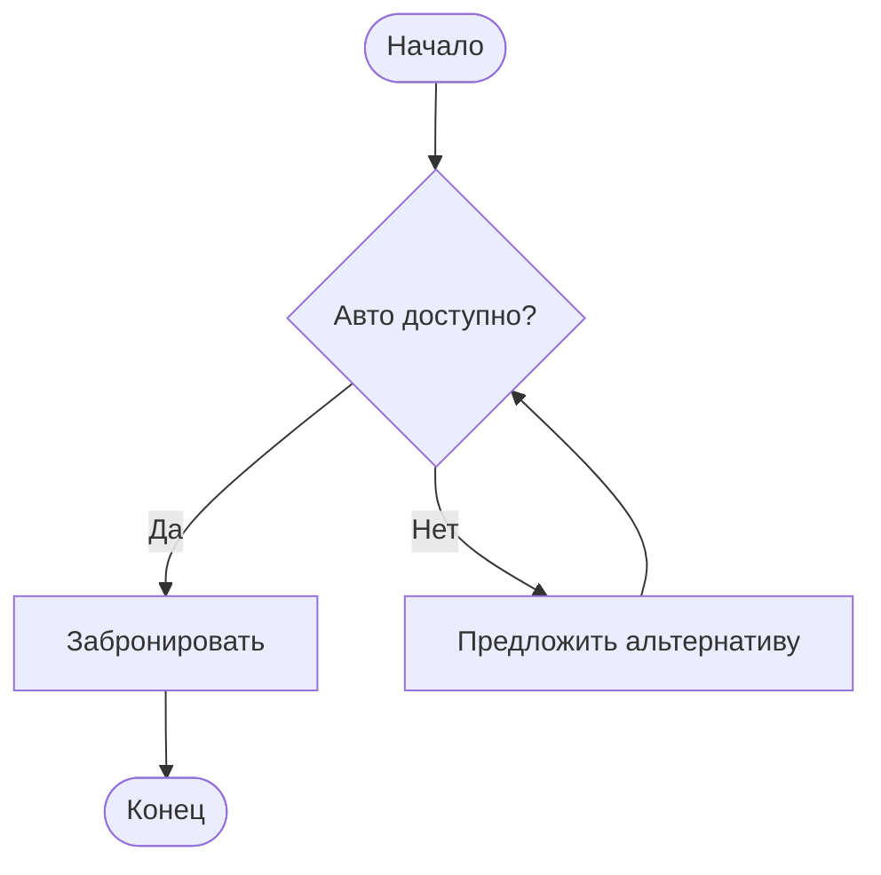
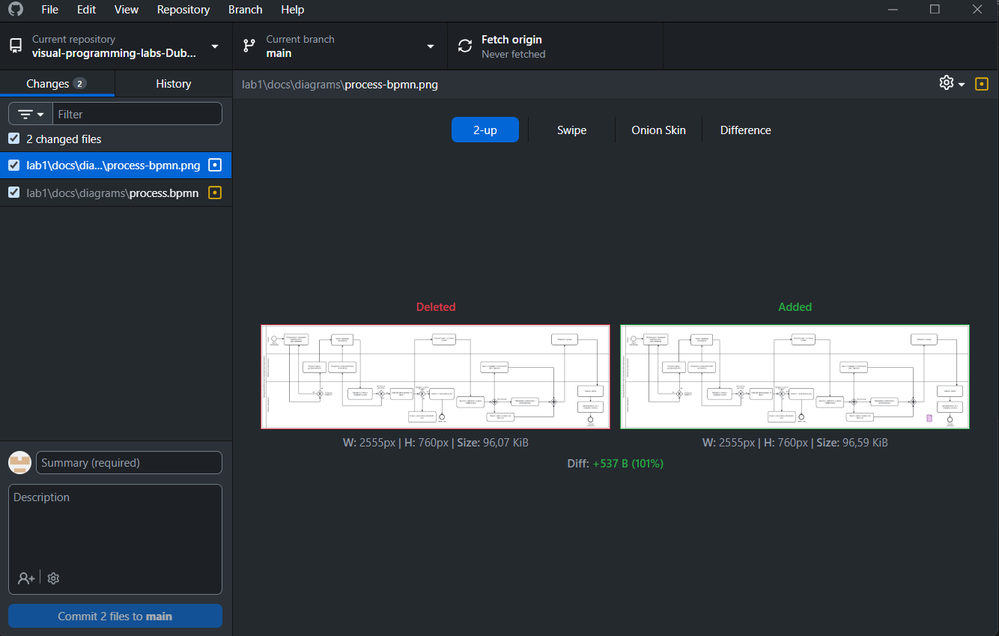
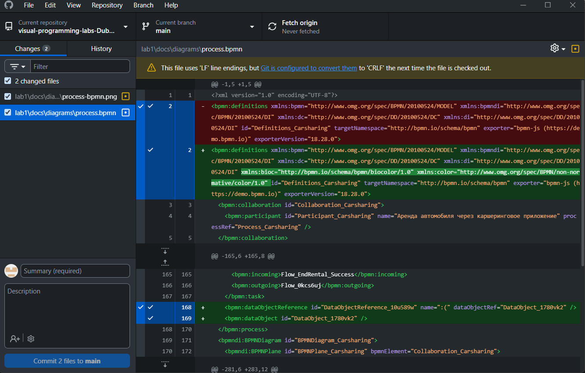
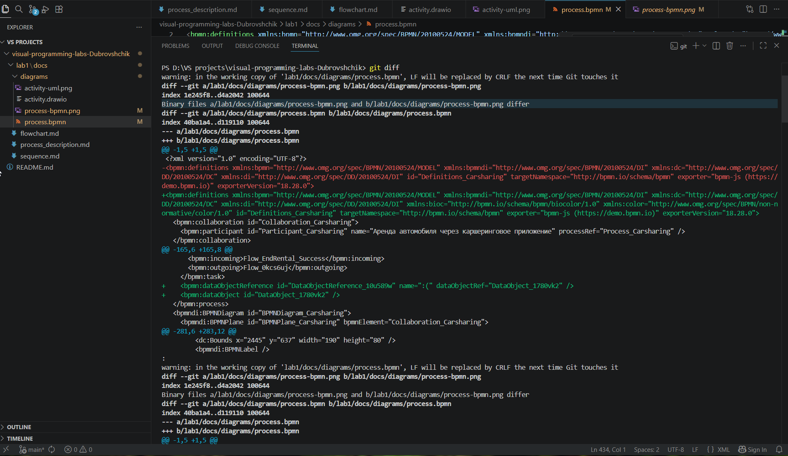

## 1. Краткое описание процесса
Клиент авторизуется в приложении, выбирает через карту подходящий автомобиль. Сервер проверяет автомобиль. Если он недоступен - клиенту предлагаются другие варианты. Если доступен - автомобиль бронируется на 15 минут.

Если клиент не начал поездку за это время, то бронь снимается. Если успел - в автомобиле разблокируются двери, клиент проходит фотофиксацию, запускается двигатель и тарификация

Во время поездки выполняются: передача телеметрии в диспетчерскую, расчет стоимости по минутам, построение маршрута и запретных зон для парковки
По завершению аренды автомобиль закрывается и клиенту отпарвляется чек.

---

## 2. Диаграммы

### 2.1. BPMN-диаграмма

Файл: [`diagrams/process.bpmn`](diagrams/process.bpmn)

### 2.2. UML Activity Diagram

Файл: [`diagrams/activity.drawio`](diagrams/activity.drawio)

### 2.3. Sequence Diagram (Mermaid)

Файл: [`docs/sequence.md`](docs/sequence.md)

### 2.4. Flowchart (Mermaid)

Файл: [`docs/flowchart.md`](docs/flowchart.md)

---

## 3. Скриншоты diff

---

## 4. Выводы
Если говорить конкретно о том, что я узнала нового - так это 95% информации, поскольку никогда с git ранее не сталкивалась. Очень полезными и интересными оказались диаграммы, однако некоторые процессы в диаграммах можно интерпретировать по-разному(по крайней мере я с этим сталкивалась, возможно, в силу неопытности), отсюда вытекают трудности и сомнения. Формируется понимание взаимосвязи git и github, поскольку перед выполнением лабораторной работы было несколько трудно в полной мере осознавать их сущности:) Мне больше всего понравились sequence диаграммы, они очень информативны и компактны

